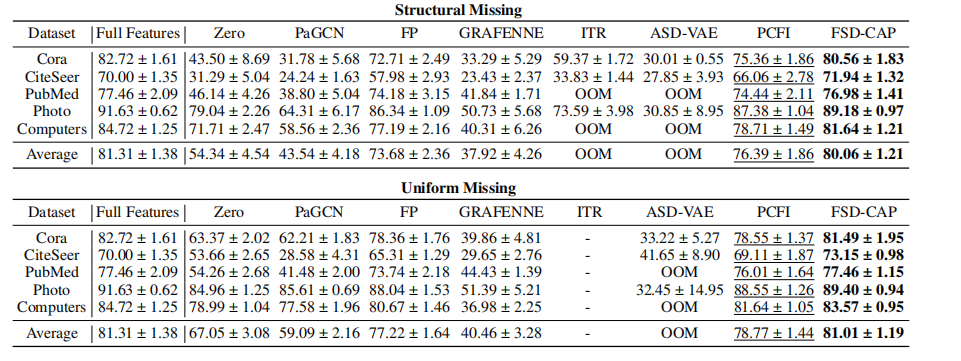
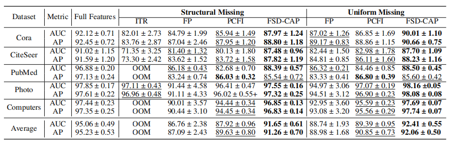

# FSD-CAP
This is the Code of "FSD-CAP: Fractional Subgraph Diffusion with Class-Aware Propagation for Graph Feature Imputation"([https://arxiv.org/abs/2030.12345](https://openreview.net/forum?id=SP5UKysA9o)). 

# For Code

## Environmental requirements
All relevant dependencies and their versions can be found in: FSD-CAP.yml. To minimize potential issues, please ensure you use the following versions:

- python=3.10.15
- pytorch>=2.2.0
- torch-geometric==2.6.1
- ogb==1.3.6

## Datasets
Two ways of obtaining data are provided

(1) The datasets Cora, Citeseer, and PubMed can be downloaded using `torch_geometric.datasets.Planetoid`, while Photo and Computers can be downloaded using `torch_geometric.datasets.Amazon`. When running FSD-CAP, it also uses these two classes from PyG to download the datasets.

(2) Alternatively, the datasets Cora, Citeseer, and PubMed, as well as Photo and Computers, can be downloaded from the following repositories respectively:  
- https://github.com/kimiyoung/planetoid  
- https://github.com/shchur/gnn-benchmark

## RUN FSD-CAP
  For the node classification task, you can run the following command:
  ```
  python run_node.py --dataset_name Cora --mask_type structural --missing_rate 0.995 --gamma 1.2 --lamda 0.2 --T 1000
  ```
  --dataset_name: Choose from "Cora", "CiteSeer", "PubMed", "Photo", "Computers"
  --mask_type: Missing data pattern — "structural" or "uniform"
  --missing_rate: Proportion of missing data, e.g., 0.995
  --gamma、lamda、T: Correspond to the symbol of the thesis
  
  For the link prediction task, you can run:
  ```
  python run_link.py --dataset_name Photo --mask_type uniform --missing_rate 0.995
  ```
  ## Results
  If you run the command as required in the paper, you will get:
  
  For node classification:
  

  For link prediction 
  

  
  ## Main Baseline Codes
  --
  - FP  : " On the Unreasonable Effectiveness of Feature Propagation in Learning on Graphs with Missing Node Features" (https://github.com/twitter-research/feature-propagation )
  - PCFI:  " CONFIDENCE-BASED FEATURE IMPUTATION FOR GRAPHS WITH PARTIALLY KNOWN FEATURES" (https://github.com/daehoum1/pcfi)
  - PaGCN: "Incomplete Graph Learning via Partial Graph Convolutional Network" (https://github.com/yaya1015/PaGCN)
  - SVGA: "Accurate Node Feature Estimation with Structured Variational Graph Autoencoder" (https://github.com/snudatalab/SVGA)
  - ITR: " Initializing Then Refining: A Simple Graph Attribute Imputation Network" (https://github.com/WxTu/ITR )
  - GRAFENNE: "GRAFENNE: Learning on Graphs with Heterogeneous and Dynamic Feature Sets" (https://github.com/data-iitd/Grafenne)
  - ASDVAE: "Incomplete Graph Learning via Attribute-Structure Decoupled Variational Auto-Encoder" (https://github.com/jiangxinke/ASD-VAE)

  ## LICENSE
  The code is ApacheLicense 2.0.The full license text can be found in the LICENSE file.
  
  


